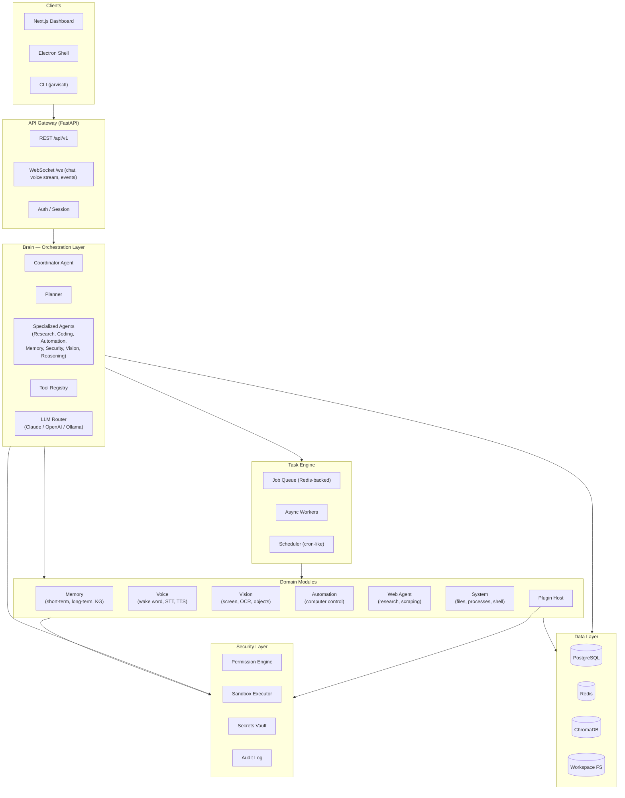

# JARVIS — Software Architecture Document

*Just A Rather Very Intelligent System*

Status: **Draft v1 — architecture & roadmap approved for incremental build**
Owner: theus.abed@yahoo.com

---

## 1. Purpose & Scope

JARVIS is a modular, local-first AI assistant platform: a long-running backend
"brain" that conversations, voice, vision, automation, and third-party
integrations all plug into, fronted by a web dashboard and an optional desktop
shell. It is **not** a single chatbot script — it is an extensible system with
clear service boundaries, a plugin API, a permission/security layer, and
persistent memory.

This document defines the target architecture. It is intentionally larger than
what will exist after the first PR — the [Roadmap](#9-implementation-roadmap)
section says exactly what ships now vs. later, and every module below states
its build phase.

---

## 2. Guiding Design Principles

1. **Modular monolith first, microservices later.** One deployable backend
   with strict internal module boundaries (enforced by import-linter rules,
   not just convention). Modules communicate through typed interfaces
   (`Protocol` classes) and an internal event bus — never by reaching into
   each other's internals. This keeps local dev/single-user deployment cheap
   while leaving a clean seam to split out e.g. `vision` or `voice` as a
   separate process/container if load demands it.
2. **Everything dangerous is mediated by the Security module.** No module
   executes shell commands, touches the filesystem outside a workspace, or
   calls a paid API without going through `security.permissions` and
   `security.audit`. This is non-negotiable and is covered in
   [§8 Security Model](#8-security-model).
3. **Local-first, cloud-optional.** Memory (Postgres/Redis/ChromaDB) and voice
   (Whisper.cpp/Piper) can run fully offline. Claude/OpenAI/Ollama are
   pluggable LLM backends behind one interface — swapping providers is a
   config change, not a rewrite.
4. **Agents are cheap, tools are the contract.** Multi-agent "reasoning" is
   built on a shared **Tool Registry**: every capability (read a file, search
   the web, click a screen coordinate) is a typed tool with a JSON schema, a
   permission tag, and an audit hook. Agents differ only in which tools they
   see and what system prompt/planning strategy they use — this avoids N
   bespoke agent implementations.
5. **Async by default.** FastAPI + `asyncio` end to end; blocking work
   (PyAutoGUI, OpenCV, Whisper inference) runs in worker processes via a task
   queue, never on the event loop.
6. **Test each module before the next.** No module is considered "done" until
   it has unit tests (business logic) and, where it touches infra, an
   integration test against a real (containerized) dependency.

---

## 3. High-Level Architecture



### 3.1 Request lifecycle (typical chat turn)

1. Client sends a message over the WebSocket (`/ws/chat`).
2. API Gateway authenticates the session, rate-limits, and forwards to the
   **Coordinator Agent**.
3. Coordinator loads short-term context from `memory.short_term`, retrieves
   relevant long-term memories via ChromaDB semantic search, and asks the
   **Planner** whether this is a direct reply or a multi-step task.
4. For a task, the Planner produces a plan (ordered tool calls / sub-agent
   delegations), submitted to the **Task Engine**.
5. Each tool call is checked against `security.permissions` before execution;
   dangerous actions raise a **confirmation request** pushed back to the
   client over the WebSocket and block until the user approves (or times
   out/denies).
6. Results stream back to the client as they complete; the final assistant
   message and any new facts are written to memory (short-term always,
   long-term via the Memory Agent's summarization/extraction pass).
7. Every tool invocation, permission decision, and LLM call is written to the
   **Audit Log** with a correlation ID for the whole turn.

---

## 4. Tech Stack & Rationale

| Layer | Choice | Why |
|---|---|---|
| Backend framework | FastAPI + AsyncIO | Native async, Pydantic validation, WebSocket support, auto OpenAPI docs |
| Primary DB | PostgreSQL | Relational integrity for users, tasks, conversations, plugin config, audit log |
| Cache / queue | Redis | Pub/sub for the event bus, Redis Streams for the job queue, session cache |
| Vector memory | ChromaDB | Embedded or client/server mode, simplest path to semantic long-term memory |
| LLM | Claude API (primary), OpenAI (secondary), Ollama (local/offline) | One `LLMProvider` interface; Claude default for reasoning/coding, local model as privacy/offline fallback |
| Speech-to-text | Whisper (faster-whisper) | Best open accuracy/latency tradeoff, runs locally |
| Text-to-speech | Piper (local) / ElevenLabs (cloud, optional) | Piper for offline/free, ElevenLabs behind a flag for higher quality |
| Vision | OpenCV + Tesseract/EasyOCR + `mss`/`pyautogui` screenshot | Standard, well-supported, no vendor lock-in |
| Automation | Playwright (browser), PyAutoGUI (desktop input) | Playwright for reliable, scriptable web automation; PyAutoGUI for OS-level input |
| Frontend | Next.js + React + TailwindCSS | SSR dashboard, fast iteration, easy WebSocket client |
| Desktop | Electron wrapping the Next.js build | Cross-platform shell, tray icon, global hotkey for wake word |
| Containers | Docker Compose (dev), per-service Dockerfiles | Reproducible local stack: api, worker, postgres, redis, chroma, frontend |
| CI | GitHub Actions | Lint, type-check, unit + integration tests, build images on PR |

**Provider abstraction note:** `LLMProvider`, `STTProvider`, `TTSProvider` are
`Protocol` interfaces in `core/interfaces.py`. Concrete adapters
(`ClaudeProvider`, `OpenAIProvider`, `OllamaProvider`, ...) are selected at
runtime from config — swapping models never touches calling code.

---

## 5. Module Map

Each module is an independent Python package under `backend/src/jarvis/`,
with its own `README.md`, `tests/`, and a narrow public interface exported
from `__init__.py`. Cross-module calls go through interfaces, not concrete
classes.

```
core/          Settings, DI container, logging, exceptions, event bus, base interfaces
brain/         LLM router, agent runtime, tool registry, conversation orchestration
memory/        Short-term (Redis) + long-term (Postgres + ChromaDB) + knowledge graph
voice/         Wake word, streaming STT, TTS, VAD, emotion tagging
vision/        Screen capture, OCR, window detection, object/image analysis, webcam
automation/    App/process control, file ops, keyboard/mouse, clipboard, notifications
web/           Research agent: search, fetch, summarize, extract tables, compare
system/        OS abstraction: safe shell exec, process mgmt, filesystem service
plugins/       Plugin manifest spec, loader, sandboxed plugin runtime, built-in plugins
security/      Permission engine, sandbox executor, secrets vault, audit log, RBAC
api/           FastAPI app, routers, WebSocket handlers, request/response schemas
agents/        Concrete agents: Planner, Coordinator, Research, Coding, Memory,
               Automation, Security, Vision, Reasoning — built on brain's tool runtime
tasks/         Job queue, async workers, scheduler, retry/pause/resume/cancel
```

Frontend (`frontend/`) and Desktop (`desktop/`) are separate top-level
packages; they talk to the backend only through the public REST/WebSocket API
— never by importing backend code.

### 5.1 Module dependency rules

- `core` depends on nothing else in the project.
- `security` depends only on `core`.
- Domain modules (`memory`, `voice`, `vision`, `automation`, `web`, `system`,
  `plugins`) depend on `core` and `security` only — never on each other or on
  `brain`.
- `brain` and `agents` depend on `core`, `security`, and the domain modules
  (via their public interfaces) to expose tools.
- `api` depends on everything (it's the composition root) but contains no
  business logic itself — only request handling, auth, and DI wiring.
- `tasks` depends on `core` and dispatches into `brain`/domain modules through
  the same tool interfaces used by agents.

This is enforced in CI with `import-linter` contracts (added when `core`
ships).

---

## 6. Memory Architecture

| Layer | Store | Contents | Retention |
|---|---|---|---|
| Short-term | Redis | Active conversation turns, working scratchpad, current task state | TTL / session |
| Episodic (long-term) | PostgreSQL | Conversation history, task history, project history, user preferences | Permanent, queryable |
| Semantic | ChromaDB | Embedded chunks of conversations/documents for similarity search | Permanent |
| Knowledge graph | PostgreSQL (edges/nodes tables) or Neo4j (phase 2 if graph queries outgrow SQL) | Entities and relations extracted from conversations ("user prefers X", "project Y uses Z") | Permanent |

**Context compression:** when a conversation's token count approaches the
model's context budget, the Memory Agent summarizes the oldest turns into a
compact episodic note (stored long-term + embedded) and replaces them in the
short-term window with the summary — never silently drops information.

**Write path:** every module that generates a fact worth remembering emits a
`MemoryCandidate` event on the internal event bus; the Memory Agent
(consumer) decides what's durable, deduplicates, and writes to the
appropriate store. Domain modules never write to Postgres/Chroma directly.

---

## 7. Multi-Agent System

- **Coordinator** — entry point for every user turn; decides direct-answer vs.
  delegate-to-Planner, merges results, owns the conversation-level response.
- **Planner** — turns a goal into an ordered plan of tool calls / agent
  delegations; re-plans on failure.
- **Research Agent** — web search, doc reading, summarization (uses `web`).
- **Coding Agent** — repo read/modify/refactor/debug/test/PR (uses `system` +
  `web` + a sandboxed git/shell toolset).
- **Memory Agent** — consumes `MemoryCandidate` events, manages
  summarization/compression, answers "what do you know about X" queries.
- **Automation Agent** — drives `automation` (open/close apps, file ops,
  input) and `vision` (to see what it's doing).
- **Security Agent** — evaluates risk of a proposed plan/tool call before
  execution; the enforcement point that calls into `security.permissions`.
- **Vision Agent** — screen/webcam understanding requests.
- **Reasoning Agent** — general chain-of-thought / multi-step reasoning that
  isn't tied to a specific domain tool.

All agents are thin: a system prompt + a tool subset + an `LLMProvider` call
via `brain.llm_router`. Adding an agent is configuration (which tools it can
see), not a new execution engine.

---

## 8. Security Model

1. **Permission Engine** (`security.permissions`) — every tool is tagged with
   a risk level (`safe`, `sensitive`, `dangerous`). `safe` tools run
   immediately; `sensitive` tools are logged; `dangerous` tools (shell exec,
   file delete, sending messages/emails, spending money) require an explicit
   user confirmation round-trip, with a per-session "always allow this
   action" opt-in the user can grant/revoke.
2. **Sandbox Executor** (`security.sandbox`) — shell commands and plugin code
   run inside a restricted subprocess (resource limits, no network unless
   granted, restricted filesystem view scoped to the configured workspace
   directory) rather than directly on the host.
3. **Secrets Vault** (`security.secrets`) — API keys and credentials are
   encrypted at rest (Fernet/age, key from OS keychain or env-provided master
   key), never logged, never returned verbatim over the API.
4. **Audit Log** (`security.audit`) — append-only Postgres table: who/what
   agent, which tool, what parameters (redacted), decision, timestamp,
   correlation ID. Exposed read-only in the dashboard.
5. **RBAC** — `owner`, `operator`, `guest` roles gate which tools/plugins are
   even visible; multi-user support is phase-2 but the schema exists from
   day one.

---

## 9. Implementation Roadmap

Work proceeds **one module at a time**, each ending in: code + unit tests +
integration test (if it touches infra) + module `README.md` + green CI,
before the next module starts.

**Phase 0 — Foundation (this PR)**
- Repo scaffolding: monorepo layout, Docker Compose dev stack, CI skeleton,
  `.env.example`, top-level docs.
- `core` module: settings (env-driven, Pydantic), structured logging, base
  exceptions, DI container, internal event bus interface. Fully tested.
- `api` module: FastAPI app factory, health check, config-driven CORS, error
  handlers. Minimal, just enough to prove the stack boots.

**Phase 1 — Data & Security spine**
- `security` module: permission engine + audit log (Postgres) + secrets
  vault. Domain modules can't ship without this.
- Postgres schema/migrations (Alembic), Redis client wrapper.
- `memory` module: short-term (Redis) + conversation/episodic store (Postgres)
  first; ChromaDB semantic layer follows in the same phase.

**Phase 2 — Brain**
- `brain`: LLM router with the Claude adapter first (OpenAI, Ollama adapters
  follow the same interface), tool registry, conversation orchestration.
- `agents`: Coordinator + Planner + Reasoning Agent — enough for real
  conversations with memory, no domain tools yet.
- `api`: `/ws/chat` streaming endpoint wired to the Coordinator.

**Phase 3 — System & Web agents**
- `system`: safe shell exec (via sandbox), file management tools.
- `web`: search, fetch, summarize, extract tables.
- `agents`: Research Agent, Coding Agent (repo-scoped).

**Phase 4 — Automation & Vision**
- `automation`: app control, keyboard/mouse (PyAutoGUI), clipboard,
  notifications — all permission-gated.
- `vision`: screenshot capture, OCR, window detection; webcam/object
  detection as a follow-up slice.
- `agents`: Automation Agent, Vision Agent.

**Phase 5 — Voice**
- `voice`: wake word, streaming Whisper STT, Piper TTS, barge-in/interrupt
  handling, VAD-based turn detection.
- `api`: `/ws/voice` audio streaming endpoint.

**Phase 6 — Tasks & Plugins**
- `tasks`: Redis-Streams job queue, workers, scheduler, retry/pause/resume.
- `plugins`: manifest spec + loader + one reference plugin (GitHub) run
  through the full permission/sandbox path.

**Phase 7 — Frontend & Desktop**
- `frontend`: Next.js dashboard — conversation timeline, memory viewer, task
  monitor, system stats, plugin manager, voice animation, dark mode.
- `desktop`: Electron shell around the dashboard build, tray icon, global
  hotkey.

**Phase 8 — Hardening**
- Load/perf pass, expanded integration + e2e test suite, CI/CD image
  publishing, deployment docs for Linux/Windows/macOS.

Each phase above maps to its own PR (or small PR series). Nothing in a later
phase is assumed by an earlier one — the system is usable (chat + memory)
after Phase 2, and grows capability from there.

---

## 10. Repository Layout (target state)

```
projet-2/
├── ARCHITECTURE.md
├── ROADMAP.md
├── README.md
├── docker-compose.yml
├── docker-compose.dev.yml
├── .env.example
├── backend/
│   ├── pyproject.toml
│   ├── src/jarvis/
│   │   ├── core/
│   │   ├── security/
│   │   ├── memory/
│   │   ├── brain/
│   │   ├── agents/
│   │   ├── voice/
│   │   ├── vision/
│   │   ├── automation/
│   │   ├── web/
│   │   ├── system/
│   │   ├── plugins/
│   │   ├── tasks/
│   │   └── api/
│   └── tests/{unit,integration}/
├── frontend/            # Next.js dashboard
├── desktop/             # Electron shell
├── infra/
│   ├── docker/
│   └── ci/
└── docs/
    ├── api/
    └── diagrams/
```

This document is updated as decisions change; the Roadmap
(`ROADMAP.md`) tracks phase-by-phase status and is the source of truth for
"what's done."
